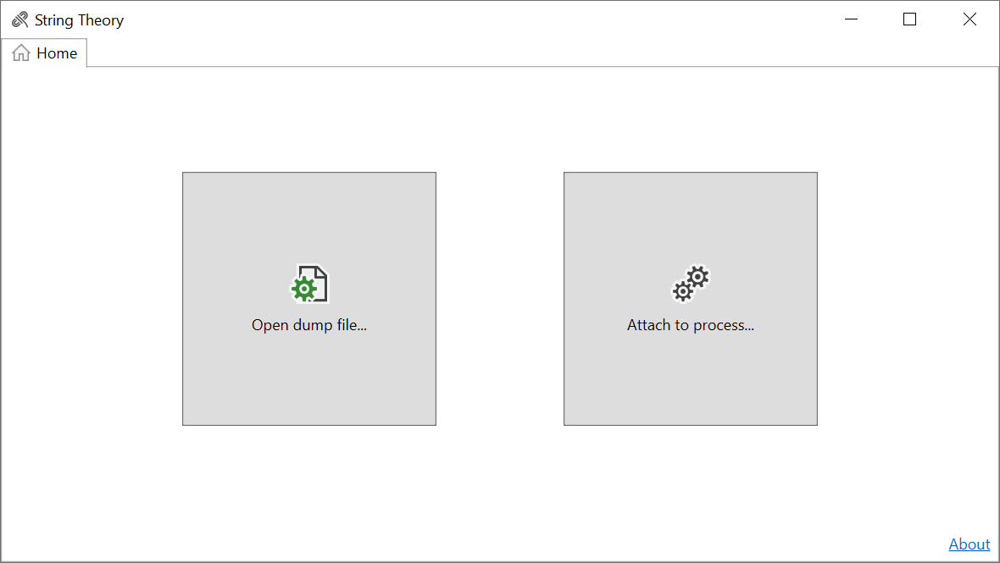
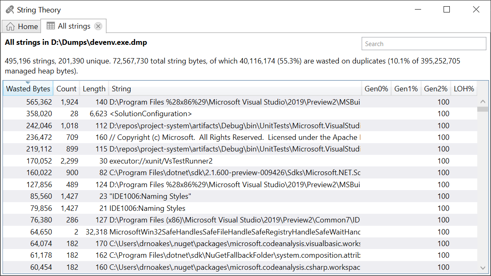
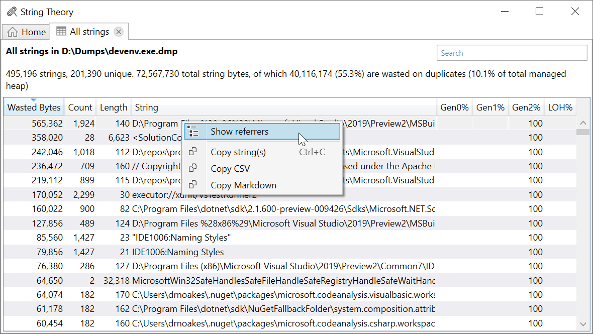
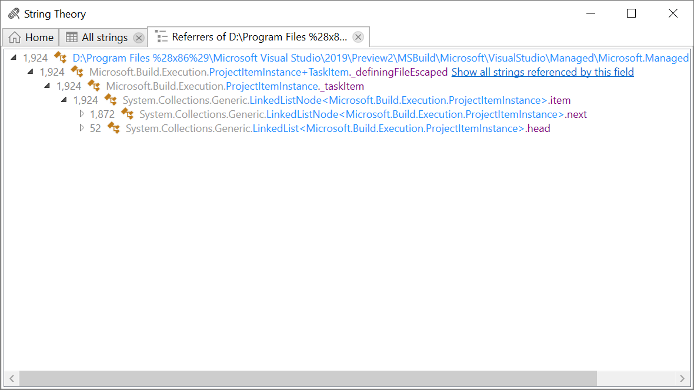
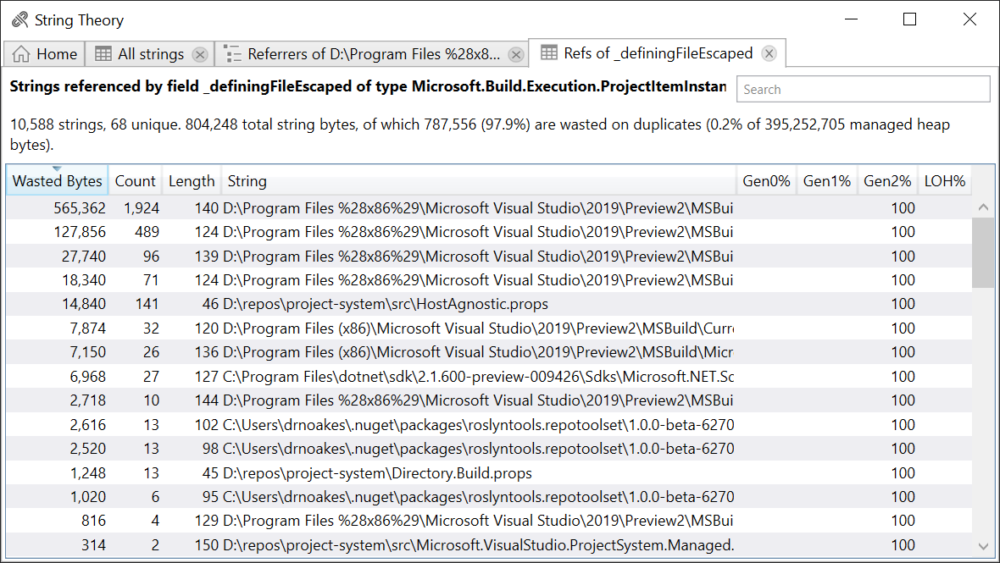

# StringTheory

Identifies opportunities to improve heap memory consumption by strings.

Finds duplicate strings and provides ways to see what object graphs are keeping them alive.

Once you identify a suspicious referrer, you can query to see what other strings it is holding across the whole heap, and the total number of wasted bytes.

## Installation

Download a ZIP file from the [GitHub releases](https://github.com/drewnoakes/string-theory/releases) page.

## Walkthrough

Running the app shows:

Either open a dump file or attach to an existing process. In this example we'll open a dump file from `devenv.exe` (Visual Studio).

Once loaded you'll see a list of all strings:

This list shows the number of duplicates and the number of wasted bytes due to that duplication per string. You can also see the percentage of each string in the different memory areas (Gen0/1/2 and the large object heap).

In this example we can see that there are 1,924 instances of an escaped path string on the heap. As strings are immutable, we may be able to replace all these copies with a single instance and save 565,362 bytes of RAM on the heap, for that string alone. However we also see many other duplicated path strings, so the savings may be much greater. These strings have also survived long enough to end up in gen2, so are likely long-lived objects.

In order to dig deeper, we need to understand what types/fields are referencing these strings. With that information we can work back and look for ways to intern/pool such strings.

Right click a string and you'll see a context menu:

Selecting "Show referrers" will produce a graph of all references to strings with this value. These are displayed as a tree:

The target string is show at the root, with referrers beneath, forming a tree. You can expand this tree as needed to learn more about the retentiion paths.

This example is relatively straightforward. We see the `_definingFileEscaped` field of the inner type `TaskItem` in MSBuild is holding on to all instances of this path string.

This field is probably referencing other strings too, and they're likely to contain duplicates as well. Click the _"Show all strings referenced by this field"_ link to produce a table showing all the strings that are referenced by that field on that type:

Here we see the full impact of duplicate strings held by `_definingFileEscaped`. From the 10,588 unique string objects there are only 68 unique values. Of the memory allocated for these strings, 97.9% is wasted. Pooling/interning these strings would reduce heap usage by 787,556 bytes.
